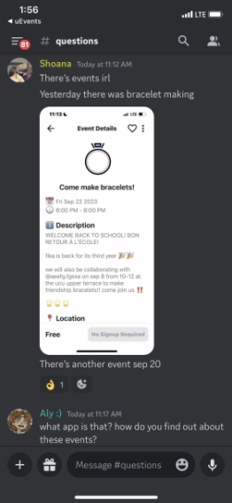
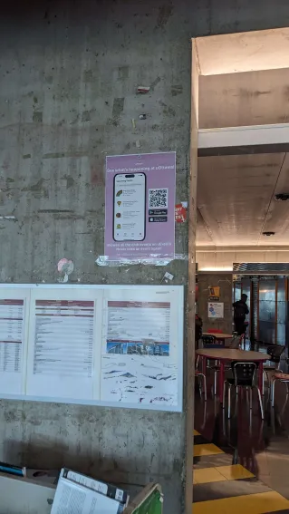
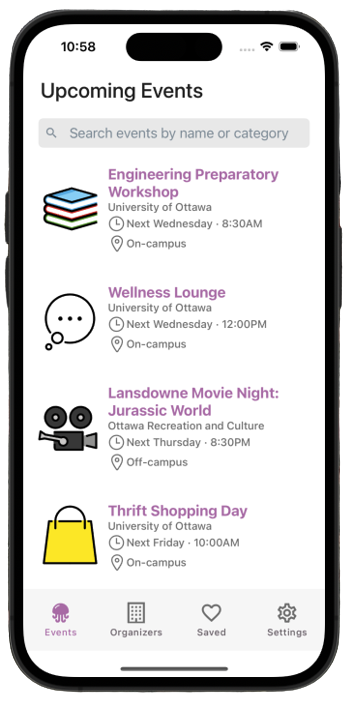
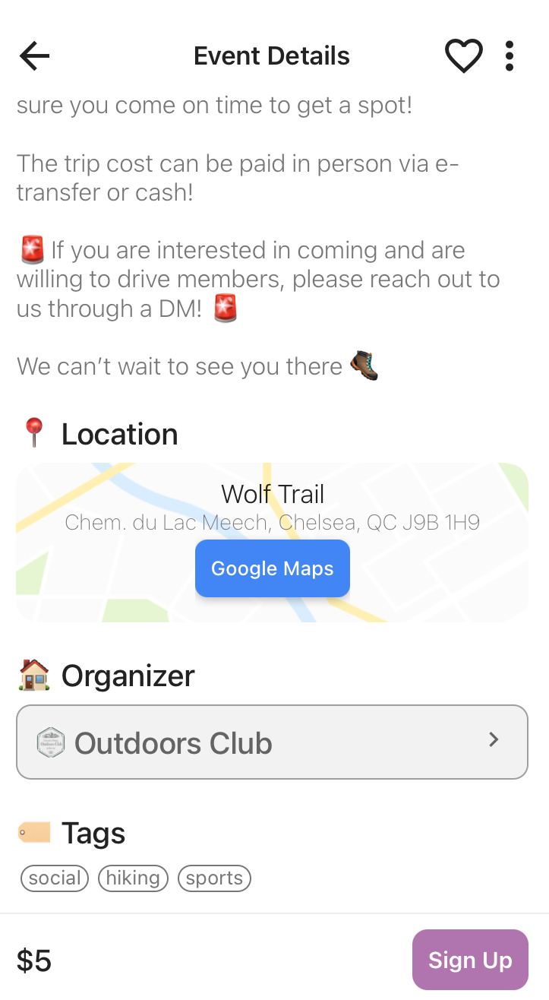
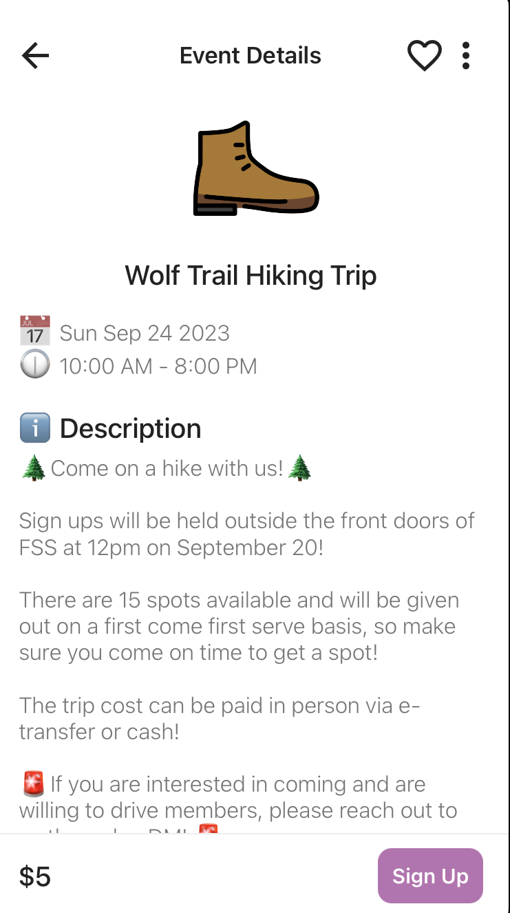
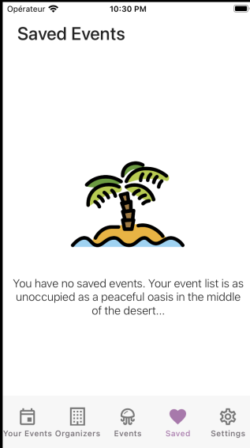
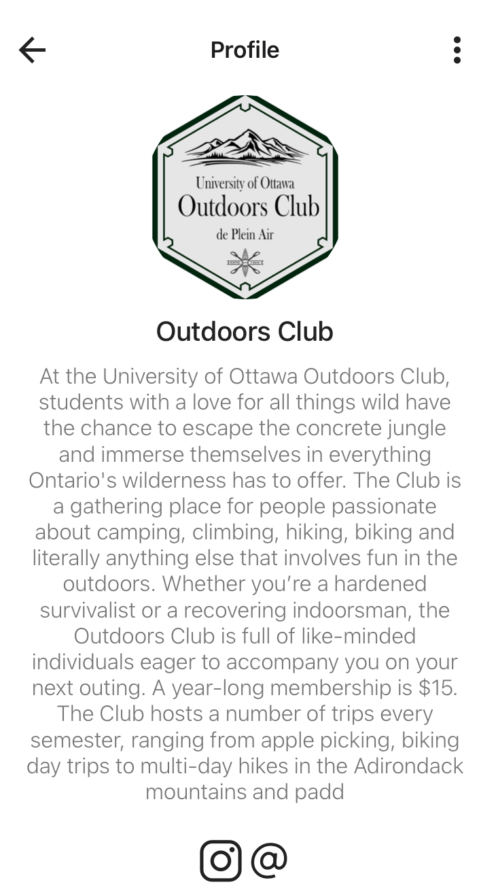

# uEvents

## Project Overview, Goals & Objectives

uEvents is a social media platform built to help uOttawa students find out what they are missing out on campus. the goal was to transform the process of finding events and communities into something as simple as opening an app.

## Reasons for Archival

Despite initial success and positive feedback from students, uEvents was ultimately archived due to several challenges. The primary issue was scalability, particularly in attracting new users, especially event organizers. This created a "chicken and egg" problem, where the platform needed more clubs and events to attract students, but without a strong user base, it was difficult to engage organizers. Additionally, maintaining long-term user engagement and managing the resources needed for continuous updates became increasingly difficult.

We experienced some success with students discussing uEvents on platforms like Discord!

  

Additionally, we invested in a marketing campaign that involved putting up posters across campus, creating a dedicated Discord server, and launching an Instagram account to promote the app.

  

## Features

The following are some major features of uEvents:
| Browsing Events | Viewing Event Details | Saving Events | Browsing Clubs |
|-----------------------------------------|----------------------------------------|--------------------------------------|--------------------------------------|
|  |   |  |  |

## Lessons Learned

Working with the university is challenging due to its bureaucratic nature, which hampered our progress. Additionally, the project began with eight members, making it difficult to manage tasks and decision-making effectively within such a large team.

## Contribution and Contributors

As of January 2024, this project has been officially shut down and is no longer actively maintained. The app was primarily developed by @antoine2304 and @wumarc, with contributions from several other team members who exited the project during its early stages. Please note that we are no longer accepting any contributions or updates, as the repository has been archived. Thank you to everyone who supported and showed interest in the project during its development.

---

## Tech Stacks and Project Structure

For the front-end, we are utilizing [React Native](https://reactnative.dev/), a JavaScript library for building mobile applications. We are also using [React Native Elements](https://reactnativeelements.com/), a UI library that provides pre-built components, to facilitate the development process. In addition, we've opted to use [TypeScript](https://www.typescriptlang.org/), a superset of JavaScript that offers optional static typing and many other features, to enhance our programming language. In addition to the UI library we are using, [React Navigation](https://reactnavigation.org/) is an important library we will make use of to implement routing and navigation features. on the backend, we have opted to use [Firebase](https://firebase.google.com/), a cloud-based platform.

To guide our development process, we have adopted the atomic design principle. this methodology emphasizes breaking down the user interface into smaller, reusable components, which can be combined to create larger, more complex layouts. You can learn more about the atomic design pattern [here](https://xd.adobe.com/ideas/process/ui-design/atomic-design-principles-methodology-101/).
